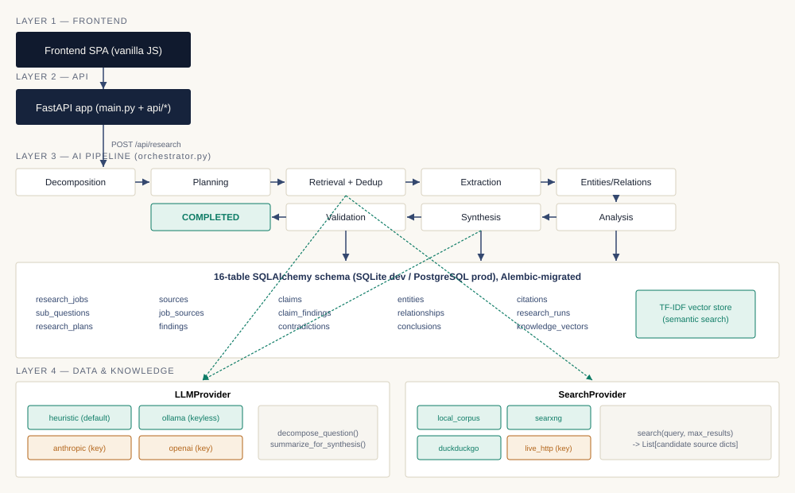

# Enterprise AI Research Agent

**A real, working AI research pipeline — not a wrapper around a chat API.**

Give it an enterprise research question. It decomposes the question, searches and retrieves real
external sources, extracts and classifies evidence, clusters it into explicit claims, compares
evidence across sources, detects and types genuine contradictions, builds an entity/relationship
graph, synthesizes evidence-grounded conclusions, and validates full traceability back to original
URLs — all backed by a real relational database and a real REST API, runnable with **zero API keys
and zero paid services** by default.


---

## Table of Contents

- [Why This Exists](#why-this-exists)
- [Key Features](#key-features)
- [Architecture](#architecture)
- [Tech Stack](#tech-stack)
- [Quick Start](#quick-start)
- [Configuration](#configuration)
- [API Overview](#api-overview)
- [Testing](#testing)
- [Project Structure](#project-structure)
- [Documentation](#documentation)
- [Known Limitations](#known-limitations)
- [License](#license)

---

## Why This Exists

Most "AI research agent" demos are a single prompt to a chat model dressed up in a nicer UI. This
project is the opposite bet: the LLM is one replaceable component *inside* a structured pipeline —
invoked at exactly two points (question decomposition and conclusion synthesis) — never the
pipeline itself. Everything in between is real, inspectable engineering: a 16-table relational
schema, deduplicated source retrieval, sentence-level evidence extraction, TF-IDF claim clustering,
a dedicated contradiction-detection stage, and a traceability validator that refuses to mark a
research job complete unless every conclusion resolves back to a real source URL.

It also runs with **no external dependency at all** out of the box — deterministic template-based
reasoning and a local search corpus — and upgrades to real LLM reasoning (Anthropic, OpenAI, or a
fully local Ollama model) and genuinely open-ended live web search (a self-hosted SearXNG instance
or DuckDuckGo) via a one-line environment variable change, with no code changes anywhere in the
pipeline.

## Key Features

- **Dynamic question decomposition** — a fixed taxonomy of nine research angles, dynamically
  parameterized by whatever topic is extracted from the question. Not hard-coded to any industry.
- **Real external retrieval** with a pluggable `SearchProvider` interface: a local corpus of
  genuinely-retrieved sources by default, or live search via SearXNG / DuckDuckGo / a paid API.
- **Evidence extraction & claim clustering** — sentence-level findings, classified into a 15-category
  enterprise taxonomy, clustered into explicit claims via TF-IDF similarity.
- **Cross-source contradiction detection** — a dedicated pipeline stage that types and explains
  genuine disagreements between sources, deliberately conservative about what counts as one.
- **Entity & relationship extraction** via a real spaCy NER model, plus a small domain vocabulary
  for AI/technology terms, linked into a queryable relationship graph.
- **Full traceability** — every conclusion is validated back through Claim → Evidence → Source →
  URL before a job is allowed to complete.
- **A knowledge base that compounds** — sources are globally deduplicated, so related research jobs
  reuse prior evidence instead of re-fetching it.
- **Honest about what it doesn't know** — an unseeded topic returns an evidence gap, not a
  confident-sounding fabrication.
- **45 automated tests** — unit, integration, and API-level, including tests that pin down real bugs
  found during development (see [`docs/architecture.md`](docs/architecture.md)).

## Architecture



Five layers: a vanilla-JS frontend, a FastAPI application layer, the AI pipeline (nine sequential
stages orchestrated as a background job), a 16-table SQLAlchemy/PostgreSQL data layer, and a
pluggable external-provider layer. Full rationale for every technology choice, the complete data
model, and a documented threshold-calibration story (real bugs found by testing against real data,
not guessed away) live in [`docs/architecture.md`](docs/architecture.md).

## Tech Stack

| Layer | Technology | Notes |
|---|---|---|
| Backend | Python, FastAPI, SQLAlchemy, Alembic | Auto-generated OpenAPI docs at `/docs` |
| Database | SQLite (dev) / PostgreSQL (prod) | One env var switches between them |
| Reasoning | Pluggable: heuristic (default) · Ollama · Anthropic · OpenAI | Heuristic mode needs no key at all |
| Search | Pluggable: local corpus (default) · SearXNG · DuckDuckGo · live HTTP API | Two keyless live options |
| NLP | spaCy (`en_core_web_sm`), scikit-learn TF-IDF | Real NER, fully local semantic search |
| Frontend | Vanilla HTML/CSS/JS | No build step, no framework |
| Testing | pytest | 45 tests, unit + integration + API |
| Deployment | Docker Compose | Postgres, backend, frontend, optional SearXNG/Celery profiles |

## Quick Start

```bash
cd backend
python3 -m venv venv && source venv/bin/activate      # Windows: venv\Scripts\activate
pip install -r requirements.txt
python3 -m spacy download en_core_web_sm
cp ../.env.example .env                                 # Windows: copy ..\.env.example .env
alembic upgrade head
uvicorn app.main:app --reload --port 8000
```

In a second terminal:

```bash
cd frontend
python3 -m http.server 5500
# open http://localhost:5500
```

No API key required for any of the above. Full setup guide (including Docker and the keyless
live-search/reasoning options) is in [`docs/architecture.md`](docs/architecture.md) and the
project's setup guide.

## Configuration

Every setting is an environment variable (`backend/.env`, from `.env.example`) — nothing is
hard-coded. The two that matter most:

| Variable | Default | Options |
|---|---|---|
| `LLM_PROVIDER` | `heuristic` (no key needed) | `heuristic` · `ollama` · `anthropic` · `openai` |
| `SEARCH_PROVIDER` | `local_corpus` (no key needed) | `local_corpus` · `searxng` · `duckduckgo` · `live_http` |

These are independent — enable either, both, or neither. See `.env.example` for the full list.

## API Overview

Interactive docs at `http://localhost:8000/docs` once running. Highlights:

```
POST   /api/research                        Start a new research job
GET    /api/research/{id}                   Job status and counters
GET    /api/research/{id}/status             Full pipeline stage log
GET    /api/research/{id}/report             Complete final report
GET    /api/research/{id}/sources            Sources, flagged new-vs-reused
GET    /api/claims/{id}                      Full evidence trace for one claim
GET    /api/sources/{id}                     Everything derived from one source
GET    /api/knowledge/search?q=...           Semantic search across the whole knowledge base
GET    /api/entities  /api/relationships     The extracted knowledge graph
```

## Testing

```bash
cd backend
pytest tests/ -v
```

45 tests: 21 unit (decomposition, dedup, classification, contradiction typing), 11 unit for the
keyless live providers (mocked HTTP against real documented API contracts), 2 integration
(full pipeline end-to-end), 11 API (through the real FastAPI app). All passing.

## Project Structure

```
enterprise-research-agent/
├── backend/
│   ├── app/
│   │   ├── api/            REST endpoints
│   │   ├── pipeline/       decomposition -> planning -> retrieval -> extraction ->
│   │   │                   entities -> analysis -> synthesis -> validation -> orchestrator
│   │   ├── providers/      llm/ and search/ pluggable backends
│   │   ├── vectorstore/    TF-IDF semantic search
│   │   ├── workers/        Celery reference implementation
│   │   └── models.py, schemas.py, database.py, config.py, main.py
│   ├── migrations/         Alembic
│   ├── seed/corpus.json    genuinely-retrieved seed sources
│   └── tests/{unit,integration,api}/
├── frontend/                vanilla JS SPA, no build step
├── docs/                    architecture, data model, scaling, requirements mapping
├── docker-compose.yml, .env.example
```

## Documentation

- [`docs/architecture.md`](docs/architecture.md) — technology rationale, data flow, provider
  resilience design, and a documented account of real bugs found and fixed during development
- [`docs/data-model.md`](docs/data-model.md) — schema design decisions
- [`docs/scaling.md`](docs/scaling.md) — a measured throughput benchmark, extrapolated to 10,000+ documents
- [`docs/requirements-checklist.md`](docs/requirements-checklist.md) — requirement-by-requirement status

## Known Limitations

- No automated frontend interaction test suite (backend/API/integration tests are complete).
- Contradiction detection compares claims within the same sub-question bucket only.
- The Celery/Redis horizontal-scaling path is real, correct reference code, not exercised under load.
- Default heuristic reasoning is genuinely dynamic but template-based, not semantic — swapping in a
  real `LLM_PROVIDER` improves nuance with no pipeline changes required.

Full detail in [`docs/architecture.md`](docs/architecture.md).

## License

[MIT](LICENSE) — see the LICENSE file for details.
