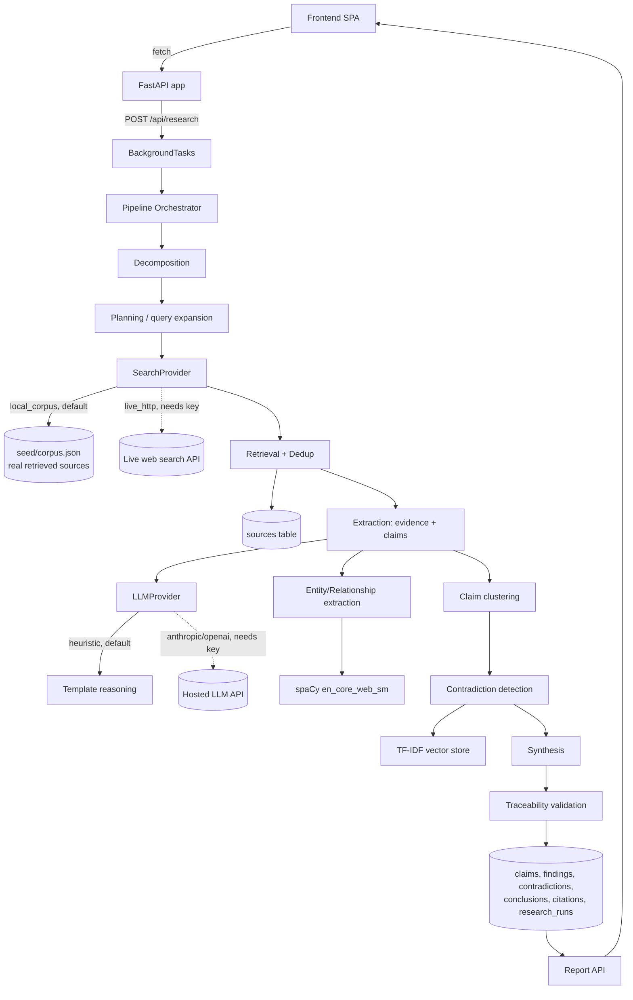

# Architecture

## Why each technology was selected

| Layer | Choice | Why |
|---|---|---|
| Backend | Python + FastAPI | Async-friendly, automatic OpenAPI docs at `/docs`, minimal ceremony for a pipeline-heavy service |
| Database | SQLite (dev) / PostgreSQL (prod, via `DATABASE_URL`) | SQLAlchemy makes these interchangeable; SQLite needs zero setup for local dev and grading, Postgres is a one-line env var swap for production (see `docker-compose.yml`) |
| Migrations | Alembic | Standard for SQLAlchemy, autogenerates from models, versioned |
| Vector search | scikit-learn TF-IDF + cosine similarity | Fully local, no model download, no GPU, deterministic — works in network-restricted environments. Swap-in path to `sentence-transformers` or an API embedding model is a single-file change (`vectorstore/tfidf_store.py`) |
| Entity extraction | spaCy `en_core_web_sm` | Real, pretrained, open-source NER — not a hard-coded name list. Falls back to a regex heuristic if the model can't load |
| LLM reasoning | Pluggable `LLMProvider` (heuristic default; Ollama/Anthropic/OpenAI real implementations included) | The assignment explicitly requires the app not depend on one proprietary vendor and to keep working if an external service is unavailable. Ollama gives a genuinely keyless *and* non-heuristic option (real local inference, no API key) — see "Keyless live search and reasoning" below |
| External search | Pluggable `SearchProvider` (local_corpus default; SearXNG/DuckDuckGo/live_http real implementations included) | Same resilience argument, with two keyless live options (SearXNG self-hosted, DuckDuckGo via `ddgs`) in addition to the paid-API path |
| Frontend | Vanilla HTML/CSS/JS, no build step | One fewer toolchain dependency for a grader to install; `fetch()` against a documented REST API works identically if you later swap in React |
| Background jobs | FastAPI `BackgroundTasks` (default) / Celery+Redis (reference implementation) | `BackgroundTasks` is genuinely non-blocking and needs no extra services for a single-process demo. `workers/celery_tasks.py` mirrors the same task for horizontal scaling — see `docs/scaling.md` |

## System diagram



## Data flow (per research job)

```
Question
  -> decompose into 9 sub-questions (fixed research-angle taxonomy, dynamically parameterized)
  -> build plan (search strategies, source categories, evidence requirements) [persisted]
  -> expand each sub-question into several search queries
  -> SearchProvider.search() per query -> candidate sources
  -> normalize URL + hash content -> dedupe against the GLOBAL sources table
       - already known -> linked as "reused" (knowledge-base reuse)
       - new -> retrieved + persisted
  -> split source content into sentences -> filter to evidence-signal candidates
  -> classify each into an enterprise category + assign to closest sub-question
  -> compute heuristic polarity + confidence + evidence_strength
  -> spaCy NER (+ domain tech-term vocabulary) -> entities; co-occurrence + relation verbs -> relationships
  -> TF-IDF-cluster findings within a sub-question into explicit Claims
       (opposite-polarity findings in the same cluster become "contradicting" evidence on that claim)
  -> compare claim pairs across the whole sub-question for cross-claim contradictions
  -> index everything into the TF-IDF knowledge-vector store (future jobs can retrieve it)
  -> synthesize a conclusion per sub-question (established / emerging / conflicting / gap)
  -> validate: walk Conclusion -> Claim -> Finding -> Source -> URL for every conclusion;
     materialize Citation rows; compute overall_confidence from the evidence graph
  -> mark COMPLETED
```

## Provider resilience ("what happens if this service goes away")

Every external dependency sits behind an abstract interface with at least one implementation that needs no external service:

- **LLM**: `LLM_PROVIDER=heuristic` (default, zero dependencies) vs `anthropic` / `openai` (needs a paid key) vs **`ollama`** (needs Ollama installed locally, but no key and no internet at inference time — see below). If every hosted provider becomes unavailable, rate-limited, or too expensive, the application keeps running in heuristic mode — decomposition, classification, and synthesis all degrade gracefully to template/rule-based output rather than failing.
- **Search**: `SEARCH_PROVIDER=local_corpus` (default) vs `live_http` (needs a paid key) vs **`searxng`** (self-hosted, no key) vs **`duckduckgo`** (no key, no service to run). If a paid search API is discontinued, several genuinely keyless alternatives already exist in this codebase, not just a documented upgrade path.
- **Embeddings**: `EMBEDDING_MODEL=tfidf` (default, local) is the only implementation shipped, deliberately — it has no external dependency at all, so there is nothing to fail over from.
- **Database**: SQLite by default; `DATABASE_URL` alone switches to Postgres, MySQL, or any SQLAlchemy-supported engine.

## Keyless live search and reasoning

Everything above the local `heuristic`/`local_corpus` defaults doesn't strictly require an API key — that was a design choice, not a hard constraint, and this codebase now includes the keyless alternatives rather than just describing them as theoretically possible:

| | Needs a key | Needs a running service | Setup effort | Reliability |
|---|---|---|---|---|
| `LLM_PROVIDER=ollama` | No | Ollama, installed locally | `curl` install + `ollama pull <model>` | High — official local inference server |
| `SEARCH_PROVIDER=searxng` | No | SearXNG, self-hosted (`docker compose --profile search up`) | One Docker service, config already written (`docker/searxng-settings.yml`) | High — aggregates several real search engines behind one stable JSON API |
| `SEARCH_PROVIDER=duckduckgo` | No | None | `pip install ddgs` | Lower — scrapes a public web UI rather than calling a documented API; can rate-limit or break on page changes |

None of these three were exercised live in this sandbox's demo run for the same reason the paid providers weren't: no route to `ollama.com`, no Docker daemon to pull the `searxng` image, and no route to `duckduckgo.com` from this sandbox's restricted network. What *was* done here, since "written but never run" is a weaker claim than necessary: each provider's request/response contract was verified against the real, current documentation (Ollama's `/api/chat` + `format:"json"` contract, SearXNG's `/search?format=json` contract) or the real installed package source (`ddgs`'s actual `TextResult` field names, read directly out of the installed library rather than assumed from memory) — see each provider file's docstring for the specific source checked and date. Each provider's request-building and response-parsing logic is also covered by unit tests against mocked HTTP responses shaped exactly like those real contracts (`tests/unit/test_keyless_live_providers.py`), so the *logic* is verified even though the *live connection* isn't, in this environment. Both are stated separately rather than one being allowed to stand in for the other.

Practical recommendation if you want a fully keyless, fully live setup: `LLM_PROVIDER=ollama` + `SEARCH_PROVIDER=searxng` is the more reliable combination (real local inference server + real self-hosted aggregating search engine, neither dependent on scraping a page layout that can change). `SEARCH_PROVIDER=duckduckgo` is the right choice if you specifically don't want to run Docker at all and can tolerate occasional flakiness.

## Threshold calibration (a real debugging note, kept here on purpose)

Early versions of claim-clustering and contradiction-detection used similarity thresholds (0.35 and 0.30) that seemed reasonable in the abstract but were **empirically wrong** for TF-IDF on single sentences: genuinely-related sentence pairs from this corpus scored 0.15–0.21, and unrelated pairs scored ~0.0. The original thresholds excluded almost everything. Recalibrating against real measured scores (`MIN_CLAIM_CLUSTER_SIMILARITY=0.12`, `MIN_CONTRADICTION_SIMILARITY=0.06`, plus enterprise-category agreement as a second signal for contradictions) took claim clustering from "36 findings → 35 near-singleton claims" to a distribution with real multi-source claims, and contradiction detection from 0 to 6 real, typed contradictions on the manufacturing corpus. This is recorded here rather than silently fixed because it's a genuine lesson about heuristic-tier NLP: guessed thresholds without empirical testing are a common, silent source of a system that runs without errors but produces nothing useful.

## Known heuristic-tier limitations

- Sub-question assignment and claim clustering are lexical (TF-IDF / keyword), not semantic — they will miss paraphrased matches a real embedding model or LLM would catch.
- Contradiction detection only compares claims *within the same sub-question bucket*; two contradictory claims that were assigned to different sub-questions won't be compared.
- Polarity scoring is a signed keyword-cue heuristic with one hand-added negation-scope rule (`"failed to achieve X"` style phrases); it is not full sentiment/entailment analysis.
- All of the above are exactly what swapping `LLM_PROVIDER=anthropic` (or `openai`) is for — the pipeline structure, database, traceability, and API do not change; only the quality of the reasoning inside `extraction.py` / `synthesis.py` does.
